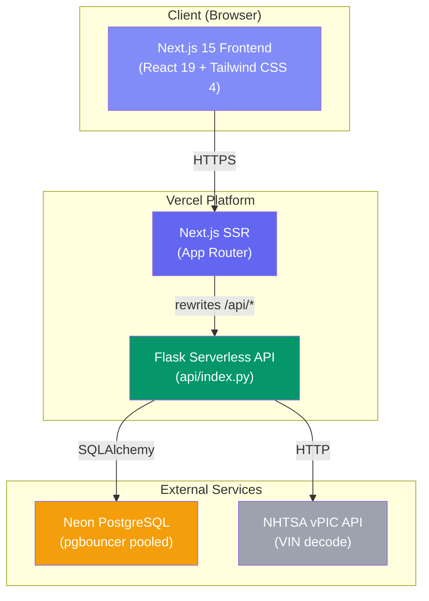
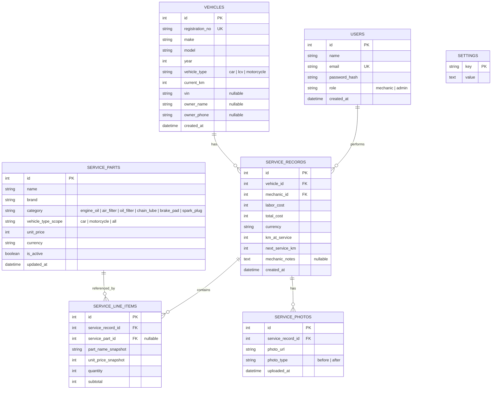

# GEARIFY-Remastered — Automotive Performance Management System

## Comprehensive Project Documentation

---

## 1. Project Overview

**GEARIFY** is a next-generation Automotive Performance Management System (APMS) designed for automotive workshops in Pakistan. It provides end-to-end service lifecycle management including vehicle registration, maintenance tracking, predictive service scheduling, digital receipt generation, and workshop analytics.

### 1.1 Project Objective

Rebuild the v1 monolithic Flask+Jinja2 application into a modern, decoupled architecture using:
- **Next.js 15** (React 19) for the frontend
- **Flask** (Python) as a serverless API backend
- **PostgreSQL** (via Neon) for persistent data storage
- **Vercel** for zero-config deployment

### 1.2 Target Market

- **Primary**: Automotive workshops and service centers in Pakistan
- **Users**: Workshop Managers (Admin), Mechanics, and Customers (read-only receipt/passport access)
- **Currency**: Pakistani Rupee (PKR) as default, configurable to any currency

---

## 2. Technology Stack

| Layer | Technology | Version | Purpose |
|-------|-----------|---------|---------|
| **Frontend Framework** | Next.js (App Router) | 15.x | Server/client rendering, routing, middleware |
| **UI Library** | React | 19.x | Component-based UI |
| **Language** | TypeScript | 5.7+ | Type-safe frontend development |
| **Styling** | Tailwind CSS | 4.x | Utility-first CSS with custom design tokens |
| **Animations** | Framer Motion | 11.x | Micro-animations, page transitions |
| **Icons** | Lucide React | 0.469+ | SVG icon system |
| **Charts** | Recharts | 2.15+ | Revenue trend and analytics visualizations |
| **Backend Framework** | Flask | 3.1.x | REST API endpoints |
| **ORM** | SQLAlchemy | 2.0.x | Database models and queries |
| **Database** | PostgreSQL (Neon) | — | Serverless Postgres with connection pooling |
| **Authentication** | PyJWT + Werkzeug | 2.10.x / 3.1.x | JWT tokens + bcrypt password hashing |
| **QR Generation** | qrcode[pil] | 8.0 | Vehicle passport QR codes |
| **OCR** | pytesseract + Pillow | 0.3.x / 11.x | Registration plate text extraction |
| **VIN Decode** | NHTSA vPIC API | — | Free VIN auto-decode (US format) |
| **Deployment** | Vercel | — | Frontend SSR + Python serverless functions |

---

## 3. System Architecture



### 3.1 Request Flow

1. **Local Development**: Next.js dev server (`localhost:3000`) proxies `/api/*` requests to Flask (`localhost:5328`) via `next.config.mjs` rewrites
2. **Production (Vercel)**: `vercel.json` rewrites `/api/*` to the Python serverless function at `api/index.py` using `@vercel/python@4.0` runtime
3. **Authentication**: JWT tokens are stored as HTTP-only cookies (`gearify_token`) and passed automatically on every request

---

## 4. Database Schema

All models are defined in `api/models.py` using SQLAlchemy ORM.

### 4.1 Entity Relationship Diagram



### 4.2 Key Design Decisions

| Decision | Rationale |
|----------|-----------|
| **`unit_price_snapshot` on line items** | Freezes the price at time of service — admin can change prices anytime without corrupting past receipts |
| **`vehicle_type_scope` on parts** | Bike-specific oils don't appear in car service dropdowns (and vice versa) |
| **`ServiceLineItem` as join table** | Enables SQL aggregation across services for analytics (top replaced parts, revenue per part) |
| **`next_service_km` pre-calculated** | Predictive maintenance: +15,000 KM for cars/LCV, +3,000 KM for motorcycles |

---

## 5. API Endpoint Reference

All endpoints are served from `api/index.py`. Base URL: `/api/`

### 5.1 Authentication

| Method | Endpoint | Auth | Description |
|--------|----------|------|-------------|
| `POST` | `/api/auth/register` | None | Register new user (admin requires `secret_key`) |
| `POST` | `/api/auth/login` | None | Login, returns JWT in cookie |
| `GET` | `/api/auth/me` | `@require_auth` | Get current user from token |
| `POST` | `/api/auth/logout` | None | Clear auth cookie |

### 5.2 Vehicles

| Method | Endpoint | Auth | Description |
|--------|----------|------|-------------|
| `GET` | `/api/vehicles` | None | List all vehicles with health scores. `?q=` search |
| `POST` | `/api/vehicles` | `@require_auth` | Register new vehicle |

### 5.3 Services

| Method | Endpoint | Auth | Description |
|--------|----------|------|-------------|
| `POST` | `/api/services` | `@require_auth` | Create service entry with line items |
| `GET` | `/api/services/history` | None | Searchable service history. `?q=` filter |
| `GET` | `/api/services/:id` | None | Single receipt by ID |
| `DELETE` | `/api/services/:id` | `@require_role("admin")` | Admin-only record deletion |

### 5.4 Parts Catalog

| Method | Endpoint | Auth | Description |
|--------|----------|------|-------------|
| `GET` | `/api/parts` | None | List catalog. `?vehicle_type=` & `?category=` filters |
| `POST` | `/api/parts` | `@require_role("admin")` | Add new catalog part |
| `PUT` | `/api/parts/:id` | `@require_role("admin")` | Update part price/name/brand |
| `DELETE` | `/api/parts/:id` | `@require_role("admin")` | Soft-delete (deactivate) part |

### 5.5 Admin & Settings

| Method | Endpoint | Auth | Description |
|--------|----------|------|-------------|
| `GET` | `/api/users` | `@require_role("admin")` | List all user accounts |
| `DELETE` | `/api/users/:id` | `@require_role("admin")` | Delete user (self-delete blocked) |
| `GET` | `/api/settings/:key` | None | Read system setting |
| `PUT` | `/api/settings/:key` | `@require_role("admin")` | Update system setting |
| `GET` | `/api/analytics` | `@require_role("admin")` | Revenue, parts, mechanic analytics |

### 5.6 Advanced Features

| Method | Endpoint | Auth | Description |
|--------|----------|------|-------------|
| `GET` | `/api/vehicles/:reg_no/qr` | None | Generate QR code PNG for vehicle passport |
| `GET` | `/api/track/:reg_no` | None | Public vehicle tracking data (no auth) |
| `POST` | `/api/vin-decode` | None | VIN auto-decode via NHTSA API |
| `POST` | `/api/ocr/plate` | None | Registration plate OCR from image |
| `POST` | `/api/services/:id/photos` | `@require_auth` | Upload before/after photo |
| `GET` | `/api/services/:id/photos` | None | Get photos for a service record |
| `GET` | `/api/health` | None | Database connectivity health check |

---

## 6. Frontend Page Map

All pages use the Next.js App Router under the `app/` directory.

| Route | File | Auth Required | Description |
|-------|------|--------------|-------------|
| `/` | `app/page.tsx` | No | Dashboard — vehicle fleet overview with health scores, search, and KPI stats |
| `/login` | `app/login/page.tsx` | No | Login form with JWT authentication |
| `/register` | `app/register/page.tsx` | No | Registration form with role selector and admin secret key gate |
| `/services/new` | `app/services/new/page.tsx` | Yes (middleware) | Multi-step service entry — vehicle type, specs, optional parts, live cost calc |
| `/services/history` | `app/services/history/page.tsx` | No | Searchable service history table with receipt links and admin delete |
| `/receipts/:id` | `app/receipts/[id]/page.tsx` | No | Printable digital receipt with QR code, parts breakdown, photo log |
| `/track/:regNo` | `app/track/[regNo]/page.tsx` | No | Public vehicle passport — health gauge, service timeline (QR scan target) |
| `/admin` | `app/admin/page.tsx` | Yes (middleware) | 3-tab admin: Parts pricing, User management, Security/Currency settings |
| `/admin/analytics` | `app/admin/analytics/page.tsx` | Yes (middleware) | Revenue trend chart, top parts bar chart, mechanic performance table |

### 6.1 Shared Components

| Component | File | Purpose |
|-----------|------|---------|
| `Navbar` | `app/components/Navbar.tsx` | Auth-aware navigation with user badge, logout, mobile hamburger menu |
| `ThemeToggle` | `app/components/ThemeToggle.tsx` | Animated SVG sun/moon toggle (light/dark theme) |
| `VehicleCard` | `app/components/VehicleCard.tsx` | Glassmorphic card with health badge, specs, latest service info |
| `LoadingSkeleton` | `app/components/LoadingSkeleton.tsx` | Shimmer skeleton grid for loading states |
| `ThemeProvider` | `app/providers/ThemeProvider.tsx` | React context for theme state with cookie persistence |

---

## 7. Design System

### 7.1 Visual Style

GEARIFY uses a **Glassmorphism + Neumorphism** hybrid aesthetic:

- **Glassmorphism**: Semi-transparent panels with `backdrop-filter: blur(16px)`, subtle borders, and layered shadows
- **Neumorphism**: Soft-shadow raised buttons with pressed/hover states
- **Mesh gradients**: Multi-point radial gradients on the page background
- **Theme**: Full dark/light mode with CSS custom properties

### 7.2 CSS Architecture (`globals.css`)

Custom design tokens defined as CSS variables:

| Token | Light Value | Dark Value | Usage |
|-------|-------------|------------|-------|
| `--bg-main` | `#f3f4f6` | `#0b0f19` | Page background |
| `--card-bg` | `rgba(255,255,255,0.7)` | `rgba(255,255,255,0.05)` | Glass panels |
| `--card-border` | `rgba(255,255,255,0.8)` | `rgba(255,255,255,0.08)` | Panel borders |
| `--neumorph-flat` | Light shadow pair | Dark shadow pair | Button resting state |
| `--status-good` | `#059669` | `#10b981` | Health ≥80 |
| `--status-warning` | `#d97706` | `#f59e0b` | Health 50–79 |
| `--status-danger` | `#dc2626` | `#ef4444` | Health <50 |

### 7.3 Typography

- **Primary Font**: Inter (Google Fonts), loaded via `next/font/google` with `--font-inter` CSS variable
- **Fallbacks**: system-ui, -apple-system, sans-serif

---

## 8. Business Logic

### 8.1 Health Score Formula

The vehicle health score (0–100) is calculated in `api/index.py`:

```
score = 100 - (km_ratio × 40) - (days_ratio × 30) - (flagged_penalty × 30)
```

Where:
- **km_ratio** = `min(km_since_service / service_interval, 2.0)` — how far past the service interval
- **days_ratio** = `min(days_since_service / 180, 2.0)` — time decay (6-month ceiling)
- **flagged_penalty** = `1.0` if mechanic noted issues, `0.0` otherwise

### 8.2 Health Status Mapping

| Score Range | Status | Badge Color |
|-------------|--------|-------------|
| 80–100 | Good | Emerald/Green |
| 50–79 | Warning | Amber/Yellow |
| 0–49 | Danger | Rose/Red |

### 8.3 Predictive Maintenance

Next service KM is calculated automatically when a service entry is created:

| Vehicle Type | Interval |
|-------------|----------|
| Car / LCV | current_km + **15,000** KM |
| Motorcycle | current_km + **3,000** KM |

### 8.4 Cost Calculation

Total cost is computed server-side from selected parts + labor:

```
total_cost = SUM(selected_part.unit_price for each part) + labor_cost
```

- All part categories are **optional** (nullable) — mechanic only selects what was actually replaced
- Prices are **snapshot-frozen** in `ServiceLineItem.unit_price_snapshot` at time of service
- Currency respects the shop's `default_currency` setting (defaults to PKR)

---

## 9. Role-Based Access Control

| Feature | Mechanic | Admin | Customer (Public) |
|---------|----------|-------|-------------------|
| View Dashboard | ✅ | ✅ | ✅ |
| Create Service Entry | ✅ | ✅ | ❌ |
| View Service History | ✅ | ✅ | ❌ |
| View/Print Receipts | ✅ | ✅ | ✅ (via link) |
| Scan QR / Vehicle Passport | ✅ | ✅ | ✅ |
| Delete Service Records | ❌ | ✅ | ❌ |
| Manage Parts Pricing | ❌ | ✅ | ❌ |
| Manage Users | ❌ | ✅ | ❌ |
| Change Admin Secret Key | ❌ | ✅ | ❌ |
| Change Currency Setting | ❌ | ✅ | ❌ |
| View Analytics Dashboard | ❌ | ✅ | ❌ |

### 9.1 Route Protection

- **Middleware** (`middleware.ts`): Redirects unauthenticated users from `/services/new` and `/admin/*` to `/login`
- **API Decorators**: `@require_auth` (any logged-in user) and `@require_role("admin")` (admin only) on Flask endpoints
- **Admin Registration Gate**: Requires matching `admin_key` setting (default: `GearifyAPMS`)

---

## 10. Seed Data & Default Credentials

### 10.1 Demo Users

| Name | Email | Password | Role |
|------|-------|----------|------|
| Admin Amaan | `admin@gearify.pk` | `admin123` | Admin |
| Mechanic Hamid | `hamid@gearify.pk` | `mech123` | Mechanic |
| Mechanic Ali | `ali@gearify.pk` | `mech456` | Mechanic |

### 10.2 Default Settings

| Key | Default Value |
|-----|--------------|
| `admin_key` | `GearifyAPMS` |
| `default_currency` | `PKR` |

### 10.3 Parts Catalog Summary

| Category | Car Variants | Motorcycle Variants | Total |
|----------|-------------|---------------------|-------|
| Engine Oil | 11 brands | 9 brands | 20 |
| Oil Filter | 8 options | shared | 8 |
| Air Filter | 7 options | shared | 7 |
| Chain Lube | — | 2 | 2 |
| Brake Pads | — | 3 | 3 |
| Spark Plugs | — | 3 | 3 |
| **Total** | | | **43 items** |

### 10.4 Demo Vehicles

15 vehicles seeded: 10 cars/LCVs + 5 motorcycles, featuring popular Pakistani market brands (Honda, Toyota, Suzuki, KIA, BMW, Mercedes, Yamaha, DFSK, MG, Mazda).

---

## 11. Project File Structure

```
GEARIFY-Remastered/
├── api/                          # Flask serverless backend
│   ├── __init__.py               # Package marker
│   ├── index.py                  # Main API entry point (1155 lines, 20+ endpoints)
│   ├── models.py                 # SQLAlchemy ORM models (6 tables)
│   ├── auth.py                   # JWT auth, password hashing, decorators
│   └── seed.py                   # Database seeder (run: python -m api.seed)
│
├── app/                          # Next.js App Router frontend
│   ├── layout.tsx                # Root layout (ThemeProvider, Navbar, footer)
│   ├── page.tsx                  # Dashboard — vehicle fleet overview
│   ├── globals.css               # Design system (glassmorphism, neumorphism, tokens)
│   │
│   ├── components/
│   │   ├── Navbar.tsx            # Auth-aware nav with mobile menu
│   │   ├── ThemeToggle.tsx       # Animated dark/light toggle
│   │   ├── VehicleCard.tsx       # Vehicle card with health badge
│   │   └── LoadingSkeleton.tsx   # Shimmer loading skeleton
│   │
│   ├── providers/
│   │   └── ThemeProvider.tsx     # React context for theme state
│   │
│   ├── types/
│   │   └── index.ts             # TypeScript interfaces (mirrors backend models)
│   │
│   ├── lib/
│   │   └── cn.ts                # clsx + tailwind-merge utility
│   │
│   ├── login/page.tsx            # Login page
│   ├── register/page.tsx         # Registration page (with admin secret key gate)
│   ├── services/
│   │   ├── new/page.tsx          # New service entry form
│   │   └── history/page.tsx      # Searchable service history table
│   ├── receipts/
│   │   └── [id]/page.tsx         # Printable digital receipt
│   ├── track/
│   │   └── [regNo]/page.tsx      # Public vehicle passport (QR scan target)
│   └── admin/
│       ├── page.tsx              # Admin console (parts, users, settings tabs)
│       └── analytics/page.tsx    # Revenue & service analytics with charts
│
├── middleware.ts                  # Next.js route protection middleware
├── next.config.mjs               # Next.js config (API proxy in dev)
├── vercel.json                   # Vercel deployment config
├── package.json                  # Node.js dependencies
├── requirements.txt              # Python dependencies
├── postcss.config.mjs            # PostCSS config for Tailwind v4
├── tsconfig.json                 # TypeScript configuration
├── .env.example                  # Environment variables template
├── .gitignore                    # Git ignore rules
└── README.md                     # Project readme
```

---

## 12. Deployment Guide

### 12.1 Prerequisites

- Node.js 18+ and npm
- Python 3.11+
- A Neon PostgreSQL database (free tier available at neon.tech)

### 12.2 Local Development Setup

```bash
# 1. Clone the repository
git clone https://github.com/theamaanmohsin/-GEARIFY-Remastered.git
cd GEARIFY-Remastered

# 2. Install Node.js dependencies
npm install

# 3. Install Python dependencies
pip install -r requirements.txt

# 4. Set up environment variables
cp .env.example .env
# Edit .env with your Neon DATABASE_URL and JWT_SECRET

# 5. Seed the database with demo data
python -m api.seed

# 6. Start both servers
# Terminal 1 — Flask API:
npm run api
# Terminal 2 — Next.js frontend:
npm run dev

# Open http://localhost:3000
```

### 12.3 Vercel Deployment

1. Push code to GitHub
2. Import project in Vercel dashboard
3. Set environment variables in Vercel project settings:
   - `DATABASE_URL` — Neon pooled connection string
   - `JWT_SECRET` — Random 64-char hex string
   - `FRONTEND_URL` — Your Vercel deployment URL
4. Deploy — Vercel auto-detects Next.js + Python serverless functions

### 12.4 Vercel Configuration

```json
{
  "rewrites": [
    { "source": "/api/(.*)", "destination": "/api/index" }
  ],
  "functions": {
    "api/index.py": {
      "runtime": "@vercel/python@4.0",
      "maxDuration": 30
    }
  }
}
```

---

## 13. Feature Matrix — v1 vs v2

| Feature | v1 (Flask Monolith) | v2 (Next.js + Flask API) |
|---------|--------------------|-----------------------|
| **Architecture** | Monolithic (Jinja2 templates) | Decoupled (API + SPA) |
| **Database** | JSON flat files | PostgreSQL (Neon) |
| **Auth** | Session-based | JWT tokens (HTTP-only cookies) |
| **UI Framework** | Raw HTML/CSS | React 19 + Tailwind CSS 4 |
| **Design** | Basic styling | Glassmorphism + Neumorphism |
| **Theme** | None | Dark/Light toggle |
| **Animations** | None | Framer Motion micro-animations |
| **Vehicle Types** | Cars only | Cars, LCVs, Motorcycles |
| **Parts Catalog** | ~5 items | 43 Pakistan-market items |
| **Health Score** | Basic | Multi-factor (KM + time + flags) |
| **QR Passport** | ❌ | ✅ Server-generated QR codes |
| **VIN Decode** | ❌ | ✅ NHTSA API integration |
| **Plate OCR** | ❌ | ✅ Tesseract OCR |
| **Photo Log** | ❌ | ✅ Before/after photo upload |
| **Analytics** | ❌ | ✅ SQL aggregation + Recharts |
| **Mobile Support** | Partial | ✅ Responsive + hamburger menu |
| **Deployment** | Manual | ✅ Vercel (zero-config) |

---

## 14. Explicitly Excluded Features

The following features were **deliberately excluded** from scope (as specified in the project brief):

- ❌ OBD-II Bluetooth diagnostics
- ❌ WhatsApp / SMS notifications
- ❌ Test suites (Playwright, pytest)
- ❌ CI/CD pipelines
- ❌ Storybook component docs

---

*Document generated for GEARIFY APMS v2.0 — Automotive Performance Management System*
*Last updated: August 2026*
